# 2FA Email Verification

2Fa Email Verification is a Java Spring Boilerplate project, which allows you to create register/login/verify service really quick.

---

## How does it work / Features

- **Rate Limiting:** Protects `/login` and `/register` endpoints against brute-force attacks and server overload.
- **2FA Verification:** Validates user requests, checks verification status, and sends a 5-minute temporary code via email (stored in Redis).
- **JWT Security:** Authenticates users via JSON Web Tokens with expiration handling and user signatures.
- **Responsive UI:** Includes a simple React frontend styled with Tailwind CSS (responsive design for desktop and mobile).
- **PostgreSQL Database:** Securely stores user credentials with BCrypt password hashing.
- **Dockerized Environment:** Wrapped in Docker containers for seamless deployment and local development.

---

## Tech Stack

### Frontend
- **Design:** Figma
- **Framework:** React + TypeScript
- **Styling:** Tailwind CSS
- **HTTP Client:** Axios

### Backend
- **Core:** Java, Spring Boot
- **Database:** PostgreSQL (User data)
- **Cache/Storage:** Redis (2FA codes)
- **Security:** Spring Security, JWT, BCrypt
- **DevOps:** Docker & Docker Compose

---

## Testing Cases

### Endpoint Testing (Postman)
1. Creating an account with valid data 
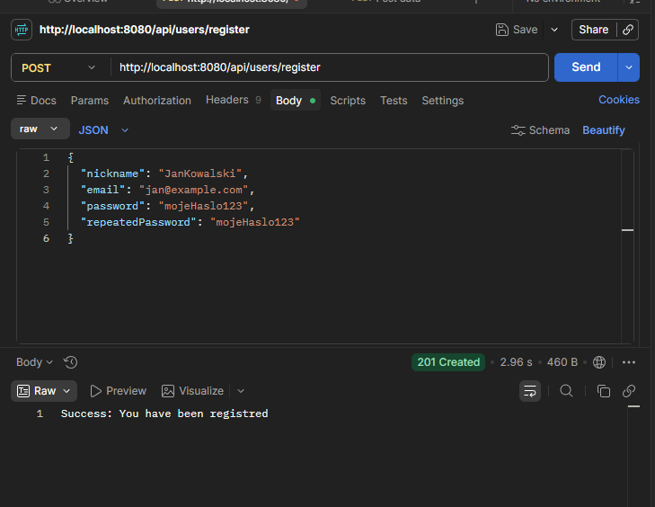
2. Handling duplicate or simultaneous requests 
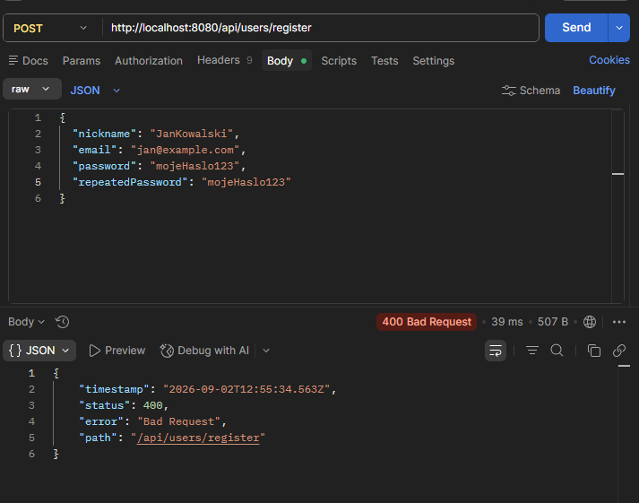
3. Sending invalid or malformed requests 
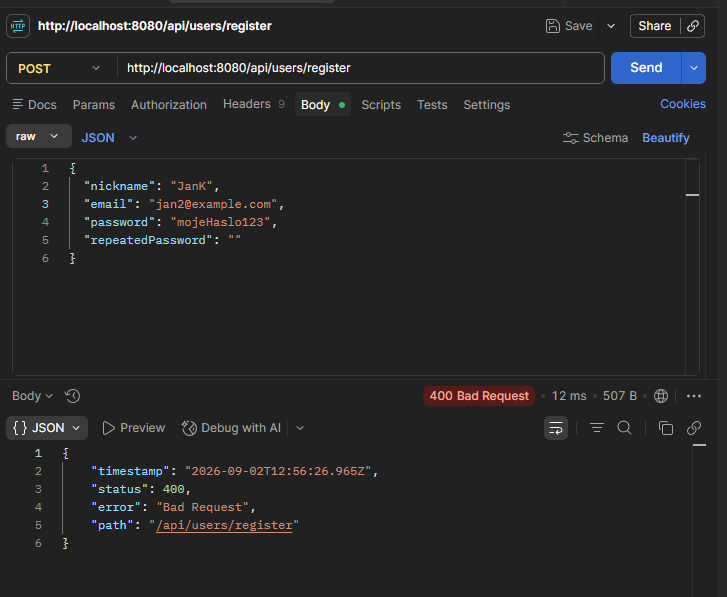
4. Logging into an unverified account 
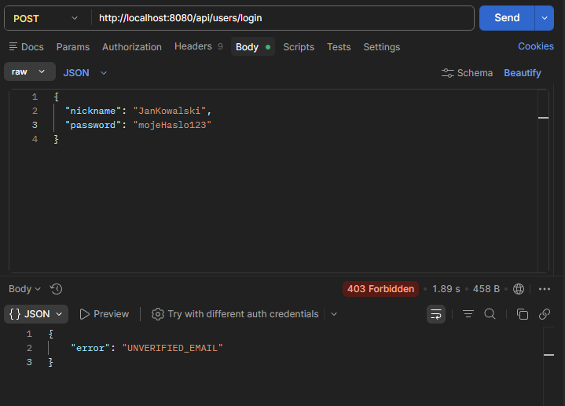
5. Receiving the email verification code 
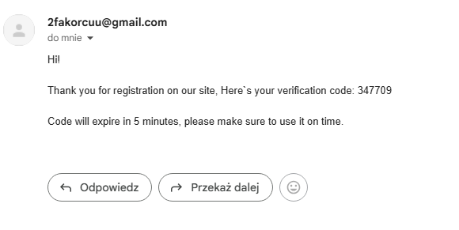
6. Successfully verifying the account 
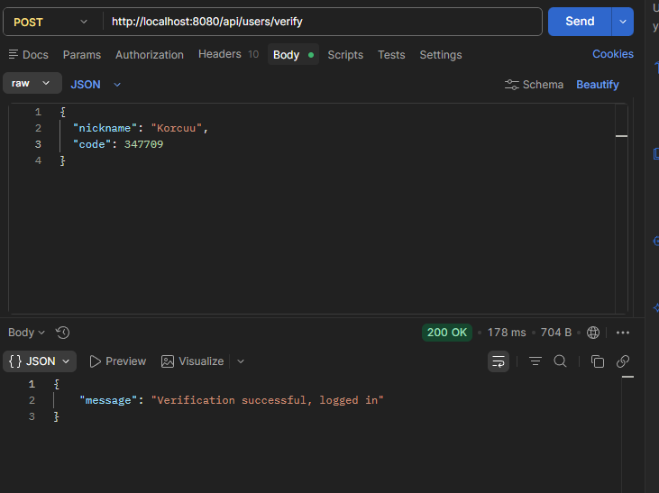
7. Attempting verification with an invalid code 
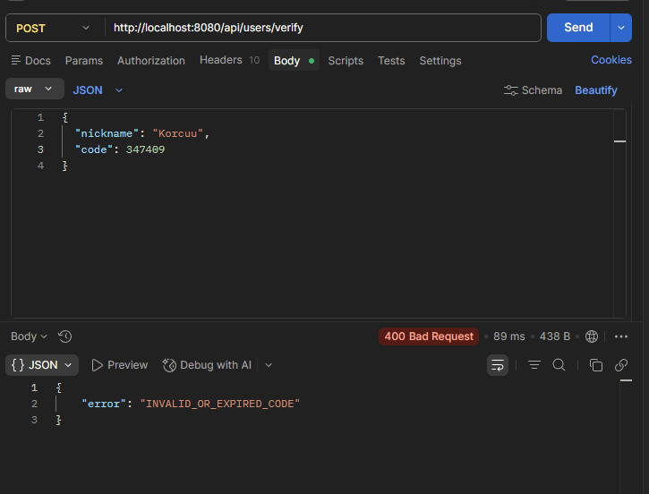

### Client-Side Testing
1. Registering a new account through the UI 
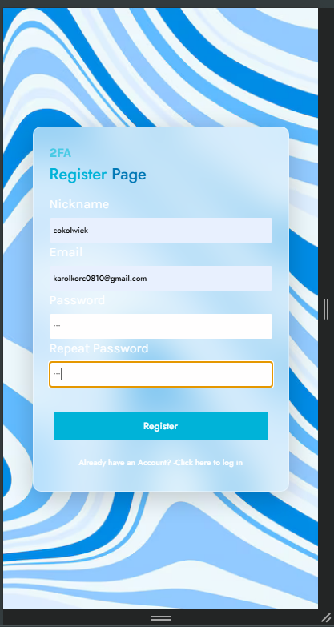
2. Receiving the verification code via email 
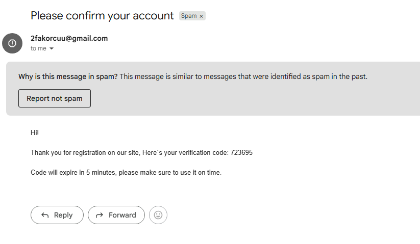
3. Successfully logging in as a verified user 
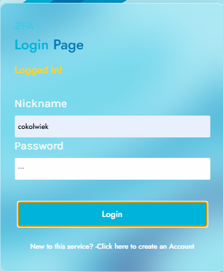

### Rate Limiter Testing (cURL)
- Sending 15 consecutive requests to verify rate limiting 
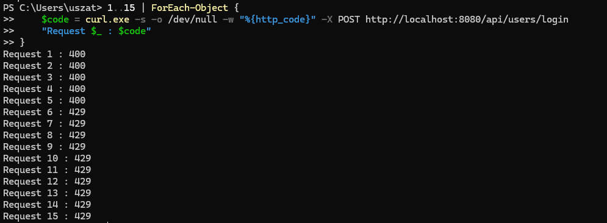

---

## Setup

### Downloading repo
```bash
git clone https://github.com/korniszonek/2faJavaSpringVerification
cd 2faJavaSpringVerification
```

### Preparation.

- Development mode requires an additional configuration file that is not included in the repository because it contains sensitive information such as JWT secrets.
A template file has been provided instead.
1. Navigate to:
```text
Server/src/main/resources
```
2. Open:

```text
application-template.properties
```

3. Fill in all required values.

4. Rename the file to:

```text
application.properties
```

- If You want to use Client app:
1. Navigate to:
```text
/2FALoginPage
```

2. Install dependencies:
```bash
npm install
```

3. Run client:
```bash
npm run dev
```

### Running docker container.

```bash
docker compose up --build
```

